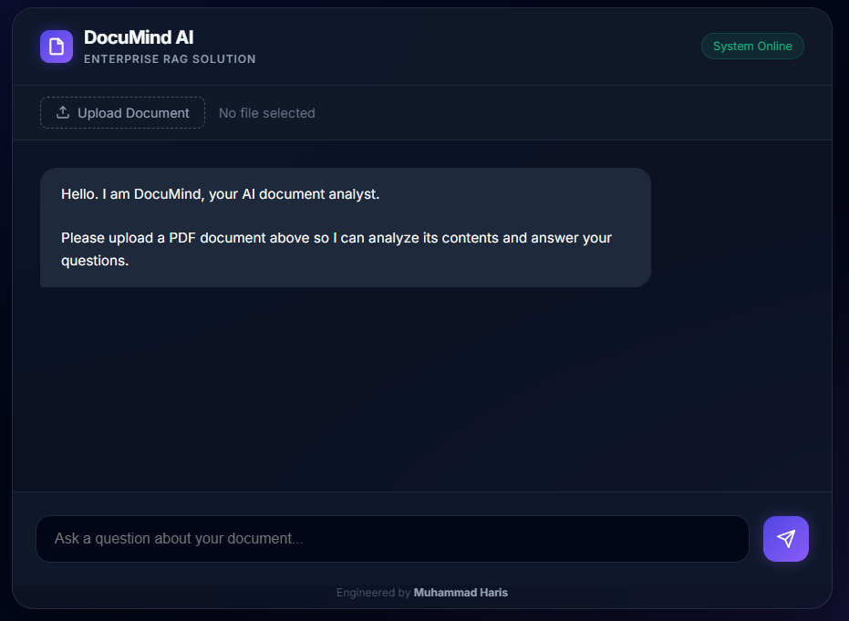

# PDF_ChatBot (DocuMind AI) — Chat with PDFs using RAG

DocuMind AI is a **PDF Question-Answering / Summarization** chatbot built with a **Retrieval-Augmented Generation (RAG)** pipeline.  
You upload a PDF, the app chunks + embeds it into a **ChromaDB** vector store, and then you can ask questions (or request a summary) powered by **LangChain + Google Gemini**.



---

## ✨ What this project does

- **PDF ingestion** using `PyPDFLoader`
- **Chunking** via `RecursiveCharacterTextSplitter`
- **Embeddings** using `sentence-transformers/all-MiniLM-L6-v2` (Hugging Face)
- **Vector database** with **ChromaDB** (persistent store)
- **RAG Q/A** using **LangChain RetrievalQA** + **Gemini (ChatGoogleGenerativeAI)**
- **API backend** with **FastAPI**
- **Experiment-first workflow** (notebook → modular code)

### About “Summarization”
There isn’t a dedicated `/summarize` endpoint yet, but you can ask:
- “Summarize this document”
- “Give me a 10-bullet summary”
- “Summarize page 1 / the section about X”

Since the chatbot answers using retrieved context, it behaves like “summary-from-retrieved-chunks”.

### About “OCR”
OCR for scanned PDFs is **not implemented yet**. It’s included in the roadmap below.

---

## 🧠 Architecture (high level)

1. **Experimentation (Notebook)**  
   Prototype the full logic end-to-end in `research/experiment.ipynb`.

2. **Modular RAG Core (`src/`)**  
   - `src/helper.py` → loading, splitting, embeddings/vectorstore
   - `src/pipeline.py` → retrieval + prompting + LLM chain

3. **Backend API (`backend/`)**
   - `backend/app.py` exposes:
     - `POST /upload` → process PDF and build vector store
     - `POST /chat` → ask questions on the uploaded PDF

4. **Frontend (planned / UI concept)**
   - The screenshot represents the intended UI flow (upload + chat).
   - You can connect any frontend (HTML/React/Streamlit) to the FastAPI endpoints.

---

## 📁 Project Structure

```bash
PDF_ChatBot/
├── backend/
│   └── app.py                  # FastAPI backend (upload + chat endpoints)
├── src/
│   ├── helper.py               # PDF loader, chunking, embeddings, Chroma store
│   └── pipeline.py             # RetrievalQA chain (Gemini + LangChain)
├── research/
│   └── experiment.ipynb        # Experimentation notebook (prototype → modularize)
├── chroma_langchain_db/        # (local) persisted vector store
├── pyproject.toml              # Dependencies (uv-based project)
├── template.sh                 # Initial scaffolding script (template approach)
└── README.md
